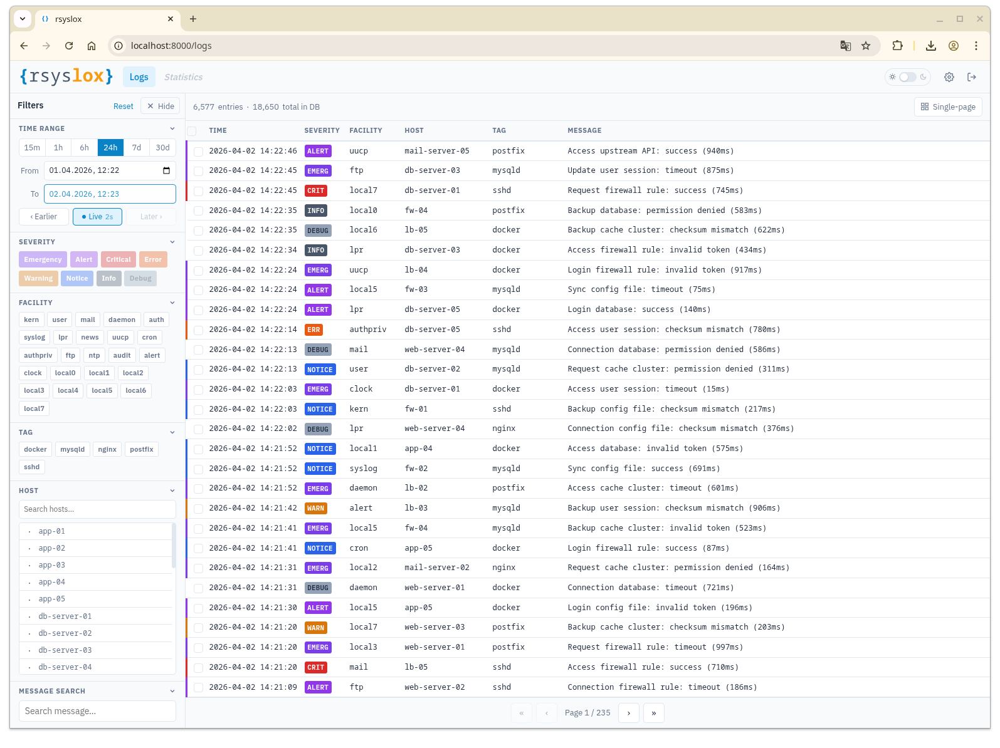
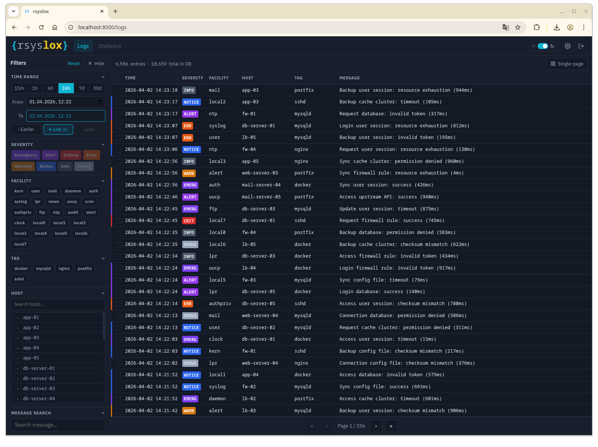

<div align="center">
  
</div>

# rsyslox

[](LICENSE)
[](https://go.dev/)
[](https://github.com/phil-bot/rsyslox/releases)

A self-hosted syslog viewer for MySQL/MariaDB syslog databases.
Single binary, no external dependencies, embedded web UI.

## Features

- Real-time log viewer with filtering by time, severity, facility, host, tag, and message
- Paginated table with dynamic row count that fills the viewport exactly
- Auto-refresh with configurable interval
- Multi-row selection, CSV / JSON export
- Detail panel with full field view and raw JSON
- Dark / light theme, i18n (English / Deutsch), adjustable font size, 12h / 24h clock
- Read-only API key management
- Log cleanup based on disk usage threshold
- Embedded API documentation (Redoc)
- All settings configurable via Admin panel — no manual config file editing required

## Requirements

- Linux (amd64 or arm64)
- MySQL / MariaDB syslog database (populated by rsyslog or compatible)
- systemd (for the installer)

## Screenshots

|  |  |
|-|-|


## Installation

```bash
sudo ./install.sh
```

The installer creates a dedicated system user (`rsyslox`), places the binary at `/opt/rsyslox/rsyslox`, registers a hardened systemd service, and starts it.

On first start, a setup wizard is served on `http://localhost:8000`. Complete it in your browser — no config file editing required.

To remove rsyslox:

```bash
sudo ./install.sh --uninstall
```

Configuration at `/etc/rsyslox/config.toml` is intentionally preserved on uninstall.

## First Run

1. Navigate to `http://<host>:8000`
2. You are redirected to the setup wizard automatically
3. Enter database credentials, admin password, and optional server settings
4. rsyslox writes its configuration and restarts into normal mode

After setup, all server-side settings (CORS, SSL, log cleanup) are editable via the **Admin panel** at `/admin`.

## Configuration

Configuration is stored at `/etc/rsyslox/config.toml` and is managed entirely through the Admin panel. Direct editing is not required or recommended.

The database password is stored AES-GCM encrypted. The admin password is stored as a bcrypt hash (cost 12). Read-only API keys are stored as SHA-256 hashes — plaintext is shown once at creation time.

The `RSYSLOX_CONFIG` environment variable overrides the config file path (useful for development).

## User Preferences

Per-user settings are stored in the browser (`localStorage`) and require no server restart:

| Setting | Options | Default |
|---|---|---|
| Language | English, Deutsch | English |
| Time format | 24-hour, 12-hour | 24-hour |
| Font size | Small, Medium, Large | Medium |
| Auto-refresh interval | 5–300 s | 30 s |

Access via **Admin → Preferences**.

## API

The REST API is documented interactively at `/docs` (served from the binary).

Authentication options:

| Method | Header | Access |
|---|---|---|
| Admin session | `X-Session-Token: <token>` | Full |
| Read-only API key | `X-API-Key: <key>` | `/api/logs`, `/api/meta` |

Obtain an admin session token via `POST /api/admin/login`.

## Development

```bash
# Run backend (requires a config file or RSYSLOX_CONFIG)
go run .

# Run frontend dev server
cd frontend && npm install && npm run dev

# Build frontend into binary
cd frontend && npm run build
go build -ldflags "-X main.Version=dev" -o rsyslox .
```

The binary embeds `frontend/dist/` and `docs/api-ui/` at build time via `go:embed`.

## Changelog

See [docs/development/changelog.md](docs/development/changelog.md).
